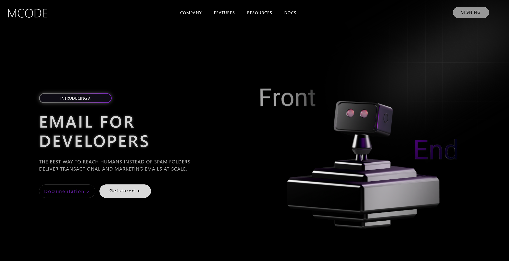

# MCODE — Build a Stunning 3D Website with HTML, CSS & Spline!

<div align="center">
  

  <br />
  <br />

  [](https://3-d-website-alpha.vercel.app/)
  [](https://github.com/kyukoten/3D-startup-app)
  [](https://community.spline.design/file/9d60c478-0e28-4514-a1ac-5605c039d6e6)

</div>

---

## 🚀 Live Preview Links

- **Live Demo Website**: [https://3-d-website-alpha.vercel.app/](https://3-d-website-alpha.vercel.app/)
- **GitHub Pages Link**: [https://kyukoten.github.io/3D-startup-app/](https://kyukoten.github.io/3D-startup-app/) *(Enable GitHub Pages in repo Settings > Pages > branch `main`)*
- **Interactive 3D Robot Scene**: [Spline Community File](https://community.spline.design/file/9d60c478-0e28-4514-a1ac-5605c039d6e6)

---

## 🌟 Overview

Responsive 3D landing page built using **HTML5**, **Vanilla CSS3**, **AOS (Animate On Scroll)**, and **Spline 3D**.

### ✨ Features
- **Interactive 3D Robot**: Embedded Cyber Robot that smoothly tracks cursor movement in real time.
- **Glowing Ambient Visuals**: Custom animated gradient tags (`.tag-box`) and ambient blur layers (`.layer-blur`).
- **Animate On Scroll (AOS)**: Smooth entrance animations across navigation items, titles, buttons, and the 3D model.
- **Fully Responsive**: Perfectly formatted across Desktop, Tablet (`1300px`), and Mobile (`768px` & `480px`).

---

## 📁 Project Structure

```text
├── index.html       # Main HTML page with embedded <spline-viewer> & AOS animations
├── style.css        # Responsive dark-mode styling & glow animations
├── thumbnail.png    # Preview screenshot of the website
└── README.md        # Project documentation
```

---

## 🛠️ Running Locally

1. Clone the repository:
   ```bash
   git clone https://github.com/kyukoten/3D-startup-app.git
   cd 3D-startup-app
   ```
2. Open `index.html` in your web browser or serve it locally:
   ```bash
   python -m http.server 3000
   ```
   Then navigate to `http://localhost:3000`.

---

## 📜 Credits
Based on the tutorial **"Build a Stunning 3D Website with HTML, CSS & Spline!"** by [MiladiCode](https://github.com/MiladiCode/3D-startup-app).
